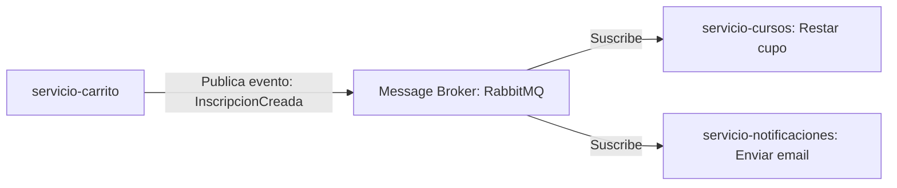

# 📝 INFORME DE EVALUACIÓN Y PROPUESTA DE MEJORAS – INSCRIBEME

Este documento recopila las observaciones y el diagnóstico técnico sobre el estado actual del proyecto **InscribeMe**, estructurado en microservicios, consolidando los resultados obtenidos de la ejecución del **Plan de Pruebas QA** (`PlanPruebas_InscribeMe.xlsx`) junto con análisis del código fuente y sugerencias arquitectónicas para futuras etapas de desarrollo.

*Nota: Conforme a las instrucciones recibidas, no se ha modificado el código del sistema. Este documento actúa como el entregable teórico para análisis y planificación previa.*

---

## 1. Mejora de Diseño FrontEnd

### 1.1. Contextualización del Cambio de Frontend
El reciente proceso de renovación del FrontEnd (migración del diseño base al uso de componentes modernos React y estilos dinámicos) se considera la base estética de las mejoras. La versión previa a estos cambios presentaba una interfaz rígida, con esquemas de color predeterminados y carencia de transiciones fluidas. 

### 1.2. Puntos Críticos Detectados en Pruebas QA (Usabilidad)
*   **TC-096 (Diseño Móvil):** La interfaz de inicio de sesión (`Login`) es funcionalmente adaptable (responsive) a un ancho de pantalla móvil (`375px`), pero se identificaron desproporciones en el tamaño de los inputs y botones de acción, afectando la ergonomía de uso en dispositivos pequeños.
*   **Ausencia de Alertas Visibles (TC-086 / TC-087):** Cuando un usuario con rol de `Estudiante` o `Instructor` intenta navegar de forma manual a rutas de administración (por ejemplo, `/admin/dashboard` o `/admin/cursos`), el sistema intercepta la petición y redirige al usuario a su perfil sin mostrar un mensaje de retroalimentación. Esto desconcierta al usuario, haciéndole creer que ocurrió un fallo en lugar de una denegación de privilegios.

### 1.3. Propuesta de Mejoras Visuales y de Usabilidad
*   **Optimización Móvil (Viewport ≤ 375px):** Redefinir mediante CSS los paddings y tamaños de tipografía para formularios de autenticación. Implementar controles táctiles amplios (mínimo `48px` de altura para botones).
*   **Mensajes de Acceso Denegado (403 Forbidden):** En lugar de redirecciones silenciosas, implementar un modal informativo o redirigir a una página limpia con el código de error `403` y una opción clara para regresar a la página anterior.
*   **Transiciones y Micro-animaciones:** Incorporar transiciones suaves en los botones de "Agregar al carrito" e indicadores de carga (`skeletons`) persistentes durante la resolución de peticiones asíncronas para mejorar el *perceived performance*.

---

## 2. Seguridad y Configuración de CORS

### 2.1. Diagnóstico del Estado Actual
Para permitir el desarrollo y pruebas locales (donde el Frontend se ejecuta en `http://localhost:5173` y se comunica con el API Gateway en `http://localhost:8080`), se realizaron ajustes temporales de CORS. Actualmente, existe una redundancia crítica y un riesgo de seguridad debido al uso de comodines:
1.  **Redundancia de Cabeceras:** Los controladores en el backend (por ejemplo, [CursoController.java](file:///c:/Users/User/OneDrive/Documentos/inscribeME_REPO/inscribeME/servicio-cursos/src/main/java/com/inscribeme/cursos/controller/CursoController.java#L21) e [InscripcionController.java](file:///c:/Users/User/OneDrive/Documentos/inscribeME_REPO/inscribeME/servicio-inscripciones/src/main/java/com/inscribeme/inscripciones/controller/InscripcionController.java#L21)) exponen de forma directa la anotación `@CrossOrigin(origins = "*")`.
2.  **Duplicación en Gateway:** El [application.yml](file:///c:/Users/User/OneDrive/Documentos/inscribeME_REPO/inscribeME/api-gateway/src/main/resources/application.yml#L20-L25) del `api-gateway` tiene declarada la propiedad `globalcors` con `allowedOrigins: "*"`. 

> [!WARNING]
> La presencia de políticas de CORS tanto en los microservicios individuales como en el API Gateway genera duplicidad en los encabezados `Access-Control-Allow-Origin` devueltos en las respuestas HTTP. Los navegadores modernos bloquean peticiones que presenten valores de CORS duplicados o conflictivos. Además, el uso de `allowedOrigins: "*"` junto con credenciales (como tokens de sesión o cabeceras de autorización JWT) es rechazado por políticas de seguridad del navegador.

### 2.2. Propuesta de Corrección y Mejora de Seguridad
1.  **Centralización en API Gateway:** Eliminar por completo todas las anotaciones `@CrossOrigin(origins = "*")` de las clases controladoras de los microservicios (`servicio-usuarios`, `servicio-cursos`, `servicio-inscripciones`, etc.). El gateway debe ser el único encargado de resolver y validar las políticas de CORS.
2.  **Uso de Perfiles de Configuración (Spring Profiles):**
    *   **Perfil `dev` (Local):** Configurar explícitamente en el Gateway que solo se admita el origen `http://localhost:5173` (o la URL de desarrollo local), habilitando el paso de cabeceras de autenticación:
        ```yaml
        spring:
          cloud:
            gateway:
              globalcors:
                cors-configurations:
                  '[/**]':
                    allowedOrigins: "http://localhost:5173"
                    allowedMethods: "GET,POST,PUT,DELETE,PATCH,OPTIONS"
                    allowedHeaders: "*"
                    allowCredentials: true
        ```
    *   **Perfil `prod` (Producción):** Configurar el dominio final de producción (por ejemplo, `https://inscribeme.cl`) para evitar que cualquier sitio externo pueda consultar las APIs del Gateway de forma directa.
3.  **Remoción de Filtros de Limpieza:** Al centralizar el CORS en el gateway, ya no será necesario mantener filtros paliativos en el código de infraestructura, como [CorsDeduplicationFilter.java](file:///c:/Users/User/OneDrive/Documentos/inscribeME_REPO/inscribeME/api-gateway/src/main/java/com/inscribeme/gateway/CorsDeduplicationFilter.java), haciendo que la base de código sea más limpia y fácil de mantener.

---

## 3. Base de Datos por Microservicio y Relaciones Fuertes

### 3.1. Diagnóstico del Estado Actual de Persistencia
El sistema actualmente respeta el patrón de diseño **Database-per-Service** mediante la creación de 6 bases de datos MySQL independientes ([create-databases.sql](file:///c:/Users/User/OneDrive/Documentos/inscribeME_REPO/inscribeME/scripts/create-databases.sql)):
*   `inscribeme_usuarios`
*   `inscribeme_cursos`
*   `inscribeme_inscripciones`
*   `inscribeme_carrito`
*   `inscribeme_notificaciones`
*   `inscribeme_reportes`

Sin embargo, para simular la relación entre las tablas, se ha recurrido a la redundancia de datos. Por ejemplo, en la tabla `inscripciones` ([seed-data.sql:L81-L93](file:///c:/Users/User/OneDrive/Documentos/inscribeME_REPO/inscribeME/scripts/seed-data.sql#L81-L93)), se copian columnas completas como `nombre_curso`, `nombre_instructor` y `nombre_usuario`. 

### 3.2. Reto Relacional en Microservicios
En una arquitectura distribuida pura con bases de datos aisladas, **no es posible definir claves foráneas (Foreign Keys) físicas entre tablas ubicadas en bases de datos distintas** (especialmente si en el futuro se migran a servidores físicos separados). Esto expone al sistema a fallos de integridad si se elimina un registro maestro (por ejemplo, borrar un curso en `servicio-cursos` que posee registros asociados en `servicio-inscripciones`).

### 3.3. Propuesta para Enforzar la Integridad Referencial
Para lograr un sistema relacionalmente "fuerte" sin violar el aislamiento de los microservicios, se deben implementar validaciones a nivel de aplicación (capa de servicios backend):

1.  **Validación Síncrona Pre-eliminación (Llamada REST/Feign):**
    *   Antes de procesar la eliminación de un curso en [CursoService.java](file:///c:/Users/User/OneDrive/Documentos/inscribeME_REPO/inscribeME/servicio-cursos/src/main/java/com/inscribeme/cursos/service/CursoService.java#L51), el microservicio `servicio-cursos` debe realizar una consulta interna al microservicio `servicio-inscripciones` mediante HTTP.
    *   Se evaluará si el contador de alumnos inscritos en ese curso es mayor a `0` (llamando al endpoint `GET /api/inscripciones/curso/{id}`).
    *   Si existen alumnos activos, el servicio rechazará la eliminación lanzando una excepción de negocio que se traduzca en una respuesta HTTP `409 Conflict` con un mensaje indicando: *"No se puede eliminar el curso porque tiene estudiantes inscritos."*
2.  **Sincronización de Datos Redundantes (Eventos/Mensajería):**
    *   Si los datos del usuario cambian (por ejemplo, se corrige la ortografía de un nombre en `servicio-usuarios`), esa actualización debe propagarse a `servicio-inscripciones` para evitar inconsistencias relacionales.
    *   Esta sincronización se puede implementar de forma eventual mediante un sistema de colas (ver sección 6).

---

## 4. Mejoras y Ajustes en las Acciones del Administrador

### 4.1. Visualización de Estudiantes y Profesores en Listas Separadas
*   **Problema:** En la pantalla actual de gestión de alumnos ([AdminStudentsPage.tsx:L228-L234](file:///c:/Users/User/OneDrive/Documentos/inscribeME_REPO/inscribeME/api-gateway/frontend/src/pages/admin/AdminStudentsPage.tsx#L228-L234)), el método `usuariosService.listarTodos()` recupera la totalidad de usuarios, pero aplica un filtro estricto por código para quedarse solo con el rol `"ESTUDIANTE"`. No hay una vista para gestionar ni visualizar el listado de Instructores (Profesores).
*   **Solución Sugerida:**
    *   Rediseñar la interfaz de administración para incluir una navegación interna por pestañas (Tabs) en la cabecera: **"Estudiantes"** y **"Profesores"**.
    *   Cuando la pestaña de Profesores esté seleccionada, se consumirá el endpoint ya existente en el backend para instructores (`usuariosService.listarInstructores()`), permitiendo al administrador auditar la información del equipo docente, verificar sus cursos asignados y consultar sus datos de contacto de forma aislada.

### 4.2. Inconsistencia al Asignar Estudiantes Directamente a los Cursos
*   **Problema (TC-022):** Cuando el administrador inscribe manualmente a un estudiante a un curso a través del panel de control (`CourseManagementPage.tsx` -> `handleAssign`), se realiza la petición directa de creación de inscripción a `servicio-inscripciones` ([CourseManagementPage.tsx:L129-L139](file:///c:/Users/User/OneDrive/Documentos/inscribeME_REPO/inscribeME/api-gateway/frontend/src/pages/admin/CourseManagementPage.tsx#L129-L139)). Sin embargo, la capacidad o cupos disponibles de ese curso en `servicio-cursos` nunca se actualiza, rompiendo la lógica del contador en el Dashboard y la vista de cursos.
*   **Solución Sugerida:**
    *   El método de creación de inscripción en el backend debe gatillar de forma obligatoria una llamada de actualización de cupos en el catálogo de cursos.
    *   Se debe diseñar un flujo en el que la creación de una inscripción reste `1` al `cupoDisponible` del curso, y la anulación o eliminación sume `1`.

### 4.3. Corrección del Acceso Rápido del Dashboard (TC-016)
*   **Problema:** El botón de acceso rápido *"Ver todos →"* localizado en la sección de *Usuarios Recientes* del Dashboard del Administrador no funciona correctamente: redirige a la lista exclusiva de estudiantes, omitiendo al resto de roles.
*   **Solución Sugerida:** Modificar la ruta del botón para que navegue a una página general de gestión de usuarios o habilitar que pase un parámetro en el estado de la ruta para pre-seleccionar el rol adecuado en la vista de destino.

---

## 5. Validaciones de Negocio, Campos y Datos de Prueba

### 5.1. Validación del Carrito (Duplicación de Cursos - TC-059 / TC-070 / TC-090)
*   **Problema Identificado:** En el backend, el microservicio `servicio-carrito` implementa de forma robusta la regla de negocio que impide agregar un curso si el alumno ya se encuentra inscrito en él ([CarritoService.java:L59-L77](file:///c:/Users/User/OneDrive/Documentos/inscribeME_REPO/inscribeME/servicio-carrito/src/main/java/com/inscribeme/carrito/service/CarritoService.java#L59-L77)). Lanza un `IllegalStateException` si se viola esta regla. 
    Sin embargo, en el Frontend ([ProductPage.tsx:L39-L46](file:///c:/Users/User/OneDrive/Documentos/inscribeME_REPO/inscribeME/api-gateway/frontend/src/pages/ProductPage.tsx#L39-L46)), el bloque `catch` que captura este error está vacío. El código asume que la petición fue exitosa y procede a añadir el curso al estado local (`setCartIds`) y desplegar la confirmación visual de agregado. Al navegar al carrito, este se consulta del servidor y, lógicamente, se muestra vacío (pues el backend bloqueó el registro).
*   **Solución Sugerida:**
    *   **Corrección en Frontend:** Modificar el manejador `handleAddToCart` de `ProductPage.tsx`. En el bloque `catch`, capturar el mensaje de error retornado por la API y mostrar una alerta en pantalla (ejemplo: *"Error: Ya estás inscrito en este curso o ya se encuentra en tu carrito"*), cancelando la adición local del ID del curso.
    *   **Bloqueo Preventivo en UI:** Antes de renderizar el botón "Agregar al carrito", comparar los cursos disponibles contra el listado de inscripciones vigentes del alumno autenticado. Si existe coincidencia, deshabilitar el botón y mostrar el texto *"Ya inscrito"*.

### 5.2. Desajuste de Cupos y Vacantes de Cursos
*   **Problema Identificado (Falta de Sincronización):** Los cursos muestran cupos utilizados pero los instructores no ven alumnos en sus listas. Esto ocurre por dos factores:
    1.  **Datos Semilla Inconsistentes:** En [seed-data.sql](file:///c:/Users/User/OneDrive/Documentos/inscribeME_REPO/inscribeME/scripts/seed-data.sql), el valor de `cupo_disponible` se estableció de forma manual e incorrecta con respecto al número real de inscripciones asociadas. Por ejemplo, en Fútbol Infantil se colocó `cupo_disponible = 12` (vacantes = 3) pero solo hay 2 registros de inscripción.
    2.  **Inexistencia de Lógica de Descuento de Cupos:** El proceso de finalización de compra en el carrito ([CarritoService.java:L133-L178](file:///c:/Users/User/OneDrive/Documentos/inscribeME_REPO/inscribeME/servicio-carrito/src/main/java/com/inscribeme/carrito/service/CarritoService.java#L133-L178)) invoca la creación de inscripciones, pero en ningún momento descuenta los cupos disponibles en la base de datos de `servicio-cursos`.
*   **Solución Sugerida:**
    *   **Calcular Vacantes de Forma Dinámica (Recomendado):** En lugar de almacenar la columna mutable `cupo_disponible` en la tabla `cursos`, calcular las vacantes de forma dinámica haciendo una consulta a `servicio-inscripciones` para contar los registros activos del curso:
        $$\text{Cupos Disponibles} = \text{Cupo Total} - \text{Inscripciones Activas}$$
    *   **Transacción Síncrona de Cupos:** Si se prefiere mantener la columna por razones de rendimiento de consultas, se debe implementar una comunicación síncrona (REST) de descuento de cupos al momento del checkout. Si la llamada para restar el cupo en `servicio-cursos` responde con error de capacidad completa, la inscripción debe fallar (operación rollback).
    *   **Corregir Datos Semilla:** Actualizar los inserts del archivo `seed-data.sql` para que el número de registros en la tabla `inscripciones` coincida exactamente con la diferencia entre `cupo_total` y `cupo_disponible`.

### 5.3. Validación de Fechas en Cursos (TC-042)
*   **Problema:** En el módulo del Instructor, los encabezados de los cursos muestran fechas correspondientes al año 2025 en lugar del año en curso (2026).
*   **Solución Sugerida:** Actualizar la carga de datos semilla en base de datos para usar fechas correspondientes al año 2026. Adicionalmente, agregar una validación en el formulario de creación de cursos para impedir el registro de cursos con fechas de inicio previas a la fecha actual del sistema.

### 5.4. Validación de Reportes Vacíos (TC-048)
*   **Problema:** El sistema deshabilita el botón de emitir reporte cuando el texto está vacío, pero no proporciona retroalimentación al usuario acerca de por qué está bloqueado.
*   **Solución Sugerida:** Mostrar un mensaje de validación claro debajo del campo de texto indicando que *"El cuerpo del reporte no puede estar vacío"* cuando el usuario intente interactuar con el formulario.

---

## 6. Sugerencias de Mejoras Arquitectónicas Adicionales (Propuestas Técnicas)

Con el fin de elevar la calidad técnica del proyecto en futuras etapas, sugerimos evaluar e incorporar las siguientes arquitecturas y patrones:

### 6.1. Arquitectura Orientada a Eventos (EDA) con RabbitMQ o Kafka
Actualmente, las llamadas entre los servicios `servicio-carrito`, `servicio-inscripciones` y `servicio-cursos` se resuelven de manera síncrona mediante `RestTemplate`. Si uno de los servicios intermedios está caído o experimenta latencia, toda la transacción del usuario falla (por ejemplo, el checkout del carrito).



*   **Beneficio:** Desacoplamiento total. Si un alumno compra un curso, el carrito registra la compra de inmediato y publica el evento `InscripcionCreada`. El servicio de cursos escucha este evento y descuenta la vacante; el servicio de notificaciones reacciona enviando la alerta. Si el servicio de notificaciones está temporalmente caído, el mensaje se encola y procesa después sin interrumpir la experiencia de compra del alumno.

### 6.2. Implementación de Feign Clients y Resilience4j
Si se opta por mantener la comunicación síncrona (REST) para consultas en tiempo real (como validar si hay cupo antes de proceder con el pago):
*   **Sugerencia:** Sustituir `RestTemplate` por **Spring Cloud OpenFeign** para declarar interfaces cliente de manera limpia.
*   **Tolerancia a fallos:** Integrar **Resilience4j** para implementar patrones de **Circuit Breaker** (Disyuntor) y **Fallback**. Si el servicio de cursos no responde al consultar los detalles de un curso, el disyuntor se abre y se retorna una respuesta por defecto previamente cacheada, evitando la caída total del flujo.

### 6.3. Auditoría de Operaciones Críticas (Spring Data JPA Auditing)
Las acciones que ejecuta el administrador en relación con inscripciones manuales, creación y eliminación de cursos requieren un registro de auditoría estricto por temas normativos y de control interno.
*   **Sugerencia:** Activar `@EnableJpaAuditing` en los modelos base. Usar las anotaciones `@CreatedBy`, `@CreatedDate`, `@LastModifiedBy` y `@LastModifiedDate` para registrar de forma automática la identidad y estampa de tiempo de cada operación en la base de datos.
