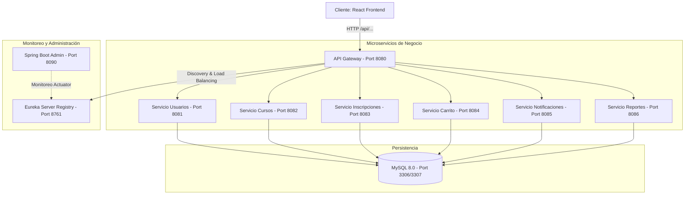

# 📝 InscribeMe - Plataforma de Inscripción de Cursos (Microservicios)

¡Bienvenido a **InscribeMe**! Una plataforma moderna e interactiva diseñada para gestionar inscripciones, cursos, asistencias y carritos de compra bajo una arquitectura de **microservicios** escalable y desacoplada. 

El proyecto utiliza **Spring Boot 3.5** y **Spring Cloud** para el backend, y un frontend dinámico desarrollado en **React 19**, **Vite 8** y **TailwindCSS v4**.

---

## 🗺️ Arquitectura del Sistema

La solución está construida sobre una arquitectura de microservicios distribuida, orquestada y monitoreada mediante herramientas nativas de Spring Cloud. A continuación se detalla el flujo de peticiones y dependencias:



---

## ✨ Características Principales

*   **Arquitectura Multi-módulo**: Proyecto estructurado con Maven Parent POM centralizado para simplificar la gestión de dependencias.
*   **Service Discovery (Eureka)**: Registro y descubrimiento dinámico de todos los servicios activos.
*   **API Gateway Inteligente**: Enrutamiento unificado de peticiones que centraliza la validación de seguridad a través de tokens **JWT**.
*   **Panel de Monitoreo (Spring Boot Admin)**: Monitoreo en tiempo real de métricas, salud de servicios (`/actuator/health`), logs y estados.
*   **Persistencia Segura**: Base de datos MySQL con almacenamiento aislado para cada servicio para cumplir con la filosofía *Database-per-Service*.
*   **Inscripción con Carrito**: Capacidad de agregar cursos al carrito de compras y formalizar inscripciones con control de cupos concurrentes.
*   **Control de Asistencia**: Módulo integrado en inscripciones para registrar la asistencia diaria de los alumnos.
*   **Alertas y Notificaciones**: Generación de logs históricos de notificaciones para los usuarios.
*   **Documentación Interactiva**: Integración con **SpringDoc OpenAPI** (Swagger UI) en todos los microservicios.

---

## 📋 Requisitos del Sistema

Para desplegar y ejecutar este proyecto de forma local, asegúrate de contar con las siguientes herramientas instaladas:

### Mínimos recomendados para ejecución local (sin Docker)
*   **Java Development Kit (JDK)** version **22**
*   **Apache Maven** version **3.9+**
*   **Node.js** version **20.x+** y npm
*   **MySQL Server 8.0** activo en puerto local (se recomienda configurar puerto `3307` o `3306` según disponibilidad)

### Mínimos recomendados para ejecución con Docker (Recomendado)
*   **Docker Desktop** (con soporte para Linux Containers)
*   **Docker Compose v2.0+**
*   *Mínimo 8 GB de Memoria RAM asignada a Docker* (el stack completo levanta 10 contenedores).

---

## 🚀 Guía de Despliegue Paso a Paso

### 1. Preparación del Entorno
Clona este repositorio y ubícate en la raíz del proyecto. Crea un archivo `.env` a partir de las configuraciones definidas (o copia el contenido del archivo `.env` existente):

```bash
# Copiar y renombrar en sistemas Unix/macOS
cp .env.example .env 
```

Asegúrate de configurar los valores correctos en tu archivo `.env`:
*   `MYSQL_ROOT_PASSWORD`: Contraseña root para MySQL.
*   `MYSQL_HOST_PORT`: Puerto de conexión en el host (`3306` o `3307`).
*   `JWT_SECRET`: Llave secreta con suficientes bits de entropía para firmar tokens JWT.
*   `SBA_PASSWORD`: Contraseña de acceso para el Spring Boot Admin Dashboard (usuario: `admin`).

---

### Opción A: Despliegue con Docker Compose (Recomendado 🐳)

Este método compila y levanta todo el ecosistema (bases de datos, frontend en Nginx y microservicios Java) con un solo comando.

1.  **Ejecutar Docker Compose**:
    En la raíz del proyecto, ejecuta el siguiente comando para construir las imágenes locales y levantar los contenedores en segundo plano:
    ```bash
    docker compose up -d --build
    ```

2.  **Inicialización de Base de Datos**:
    Al iniciar el contenedor de MySQL por primera vez, Docker ejecutará automáticamente en orden alfabético los scripts montados en `./scripts/`:
    *   `01-create-databases.sql`: Crea las 6 bases de datos independientes.
    *   `02-seed-data.sql`: Estructura las tablas básicas e inyecta datos semilla (usuarios, cursos inscritos, asistencias, notificaciones).

3.  **Monitorear Estado de Inicio**:
    Los servicios Java tardarán un par de minutos en compilar e iniciar. Puedes verificar que todo esté en orden mediante:
    ```bash
    docker compose ps
    ```
    También puedes seguir los logs grupales del inicio del sistema:
    ```bash
    docker compose logs -f
    ```

---

### Opción B: Despliegue Local Manual (Desarrollo 🛠️)

Si deseas depurar el código o ejecutarlo de manera directa en tu sistema operativo utilizando Windows/PowerShell o bash:

#### 1. Configuración de Base de Datos
*   Asegúrate de tener un servidor MySQL corriendo.
*   Ejecuta manualmente las sentencias SQL dentro de [create-databases.sql](file:///c:/Users/User/OneDrive/Documentos/inscribeME_REPO/inscribeME/scripts/create-databases.sql) para crear las bases de datos.
*   Ejecuta las sentencias en [seed-data.sql](file:///c:/Users/User/OneDrive/Documentos/inscribeME_REPO/inscribeME/scripts/seed-data.sql) para estructurar tablas e insertar datos de prueba.

#### 2. Compilar el Backend
Genera los binarios JAR del parent project y sus módulos:
```bash
mvn clean install -DskipTests
```

#### 3. Iniciar los Servicios de Backend
Puedes arrancar cada módulo en su orden respectivo usando Maven, o utilizar los scripts automatizados para Windows:

*   **Iniciar automáticamente (Windows)**:
    Ejecuta el script PowerShell proporcionado:
    ```powershell
    .\scripts\start-all.ps1
    ```
    *Este script levantará en segundo plano (minimizadas) ventanas de consola independientes para cada uno de los microservicios en su orden correcto.*

*   **Detener los servicios**:
    Si necesitas apagar todos los procesos java de Spring Boot, ejecuta:
    ```powershell
    .\scripts\stop-all.ps1
    ```

*   **Iniciar manualmente (Orden de Precedencia obligatorio)**:
    Si no estás en Windows, ejecuta en consolas separadas:
    1.  **Eureka Server**:
        ```bash
        cd eureka-server && mvn spring-boot:run
        ```
        *(Esperar 15-20 segundos a que esté UP en el puerto 8761)*
    2.  **Spring Boot Admin**:
        ```bash
        cd admin-dashboard && mvn spring-boot:run
        ```
    3.  **API Gateway**:
        ```bash
        cd api-gateway && mvn spring-boot:run
        ```
    4.  **Microservicios de negocio** (pueden iniciarse en paralelo):
        ```bash
        cd servicio-usuarios && mvn spring-boot:run
        cd servicio-cursos && mvn spring-boot:run
        cd servicio-inscripciones && mvn spring-boot:run
        cd servicio-carrito && mvn spring-boot:run
        cd servicio-notificaciones && mvn spring-boot:run
        cd servicio-reportes && mvn spring-boot:run
        ```

#### 4. Levantar el Frontend en Modo Desarrollo
El proyecto tiene dos carpetas frontend. La versión de producción e integración dockerizada reside en `api-gateway/frontend`, mientras que `front-inscribeme` funciona como entorno standalone alternativo. Ambas utilizan Vite + React.

Para iniciar el servidor de desarrollo local de Vite en [api-gateway/frontend](file:///c:/Users/User/OneDrive/Documentos/inscribeME_REPO/inscribeME/api-gateway/frontend):
```bash
cd api-gateway/frontend
npm install
npm run dev
```
El frontend se levantará en `http://localhost:5173`. Las llamadas a `/api/*` se canalizarán a través del proxy configurado en `vite.config.ts` hacia el puerto `8080` (API Gateway).

---

## 🔍 Direcciones y Puertos Útiles

Una vez desplegada la aplicación, podrás acceder a los siguientes paneles e interfaces:

| Componente / Servicio | Puerto Host | URL de Acceso | Descripción |
| :--- | :---: | :--- | :--- |
| **Portal Web (Frontend)** | `3000` (Docker) <br>`5173` (Manual) | [http://localhost:3000](http://localhost:3000) / [http://localhost:5173](http://localhost:5173) | Interfaz gráfica de usuario en React. |
| **API Gateway** | `8080` | [http://localhost:8080](http://localhost:8080) | Punto de acceso único para llamadas REST. |
| **Eureka Discovery Server** | `8761` | [http://localhost:8761](http://localhost:8761) | Dashboard para ver microservicios registrados. |
| **Spring Boot Admin** | `8090` | [http://localhost:8090](http://localhost:8090) | Panel de monitoreo (User: `admin` / Pass: `admin123`). |
| **MySQL Database** | `3307` / `3306` | `localhost:3307` (o `3306`) | Motor de base de datos relacional. |

### Documentación de APIs (Swagger UI)
Cada microservicio expone de forma directa su documentación interactiva para pruebas locales de endpoints:

*   **Servicio Usuarios**: [http://localhost:8081/swagger-ui.html](http://localhost:8081/swagger-ui.html)
*   **Servicio Cursos**: [http://localhost:8082/swagger-ui.html](http://localhost:8082/swagger-ui.html)
*   **Servicio Inscripciones**: [http://localhost:8083/swagger-ui.html](http://localhost:8083/swagger-ui.html)
*   **Servicio Carrito**: [http://localhost:8084/swagger-ui.html](http://localhost:8084/swagger-ui.html)
*   **Servicio Notificaciones**: [http://localhost:8085/swagger-ui.html](http://localhost:8085/swagger-ui.html)
*   **Servicio Reportes**: [http://localhost:8086/swagger-ui.html](http://localhost:8086/swagger-ui.html)

---

## 🔑 Credenciales y Cuentas de Prueba

El script de inicialización (`seed-data.sql`) inyecta cuentas preconfiguradas con diferentes roles para facilitar las pruebas del sistema:

| Rol | Correo Electrónico | Contraseña | Nombre | Acceso |
| :--- | :--- | :--- | :--- | :--- |
| **Administrador** | `admin@inscribeme.cl` | `admin123` | Admin Sistema | Gestión global de cursos, alumnos y notificaciones. |
| **Instructor** | `carlos@inscribeme.cl` | `instructor1` | Carlos Rojas | Dashboard de instructor y control de asistencia de sus cursos. |
| **Instructor** | `maria@inscribeme.cl` | `instructor2` | Maria Gonzalez | Dashboard de instructor y control de asistencia de sus cursos. |
| **Estudiante** | `juan@inscribeme.cl` | `estudiante1` | Juan Rodriguez | Catálogo de cursos, carrito de compras y perfil de alumno. |
| **Estudiante** | `valentina@inscribeme.cl` | `estudiante2` | Valentina Cruz | Catálogo de cursos, carrito de compras y perfil de alumno. |

---

## 🛡️ Seguridad y Flujo JWT

1. Las credenciales son enviadas a `POST /api/usuarios/login` a través del **API Gateway**.
2. El **Servicio Usuarios** valida la información contra la base de datos `inscribeme_usuarios` y responde con un token JWT firmado.
3. El cliente (React) guarda el token y lo añade en las cabeceras HTTP de peticiones subsecuentes: `Authorization: Bearer <token_jwt>`.
4. El **API Gateway** intercepta y valida la firma y vigencia del JWT antes de derivar la petición de forma reactiva al microservicio correspondiente.
5. Los perfiles y vistas del frontend se protegen mediante el componente React `ProtectedRoute` según el rol (`ADMIN`, `INSTRUCTOR` o `ESTUDIANTE`) codificado en el token.
